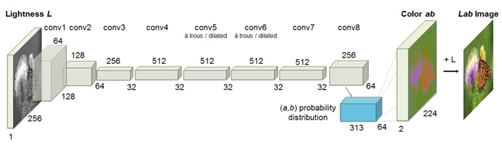
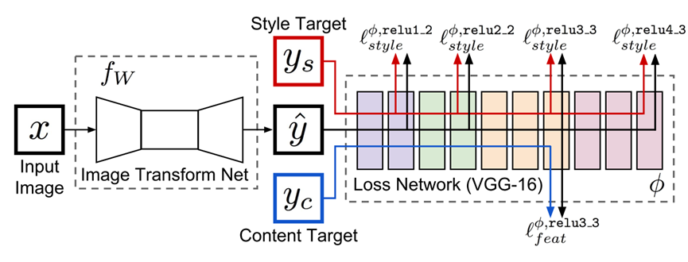
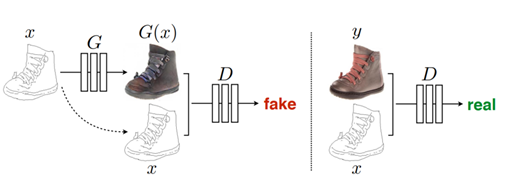
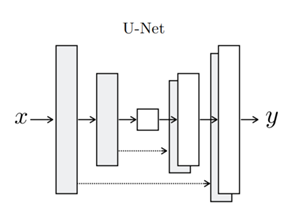
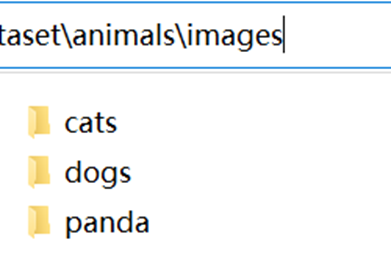
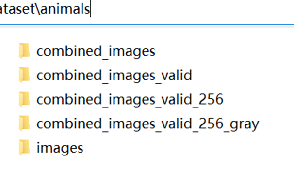
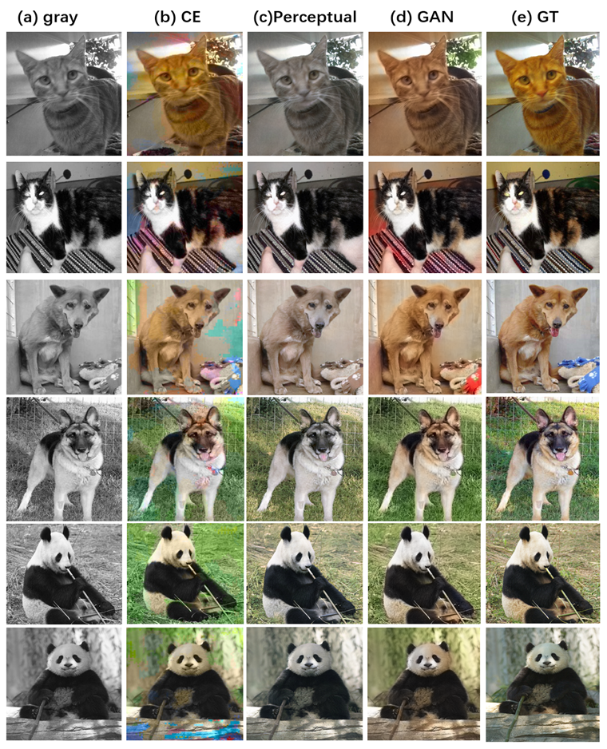
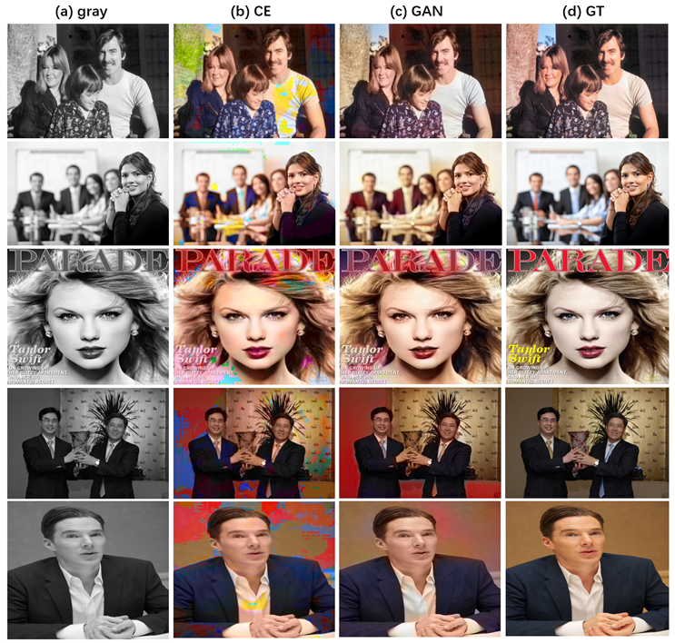

# Introduction
This project is the code for our project <B&W images colorization>.
<br>
In this project, we implemented train colorization models by cross-entropy loss, perceptual loss and adversarial loss. 
And we used two different model, one is CIC and the other is UNet.
### 1.Environment
Ubuntu>=16.04
<br>
python>=3.6
<br>
pytorch>=1.6
<br>
tensorflow>=2.0

### 2.Method
#### (1) Cross-entropy model framework


#### (2) Perceptual loss framework


#### (3) GAN framework


#### (4) UNet


# How to run
### 1.Data Prepare
Before training, we should prepare dataset first, we take the animals dataset as our example. 
The downloaded animals dataset contains three category folders like below:



Then you need to run the following five steps to pre process the downloaded dataset.
```shell script
cd data_process
python 0_merge_images.py YourPath/animals/images
python 1_removegray.py YourPath/animals/combined_images
python 2_resize_all_imgs.py YourPath/animals/combined_images_valid
python 3_graying_images.py YourPath/animals/combined_images_valid_256
python 4_generate_img_path_list.pu YourPath/animals/combined_images_valid_256
```

Then the downloaded dataset has become like below:



### 2.Training
#### (1) Training CIC or UNet with cross-entropy loss
```shell
cd CE_loss
python train.py --model CIC --model_path ../checkpoint/animals_CE_CIC \
--img_list_path ../dataset/animals_combined_images_valid_256.txt \
--log_step 10 --save_step 50 --num_epochs 600 --batchsize 32
```
#### (2) Training Perceptual loss
```shell
cd Perceptual loss
python main.py --train-flag True --cuda_device-no 0 --crop_size 240 \
--train-content Yourpath/animals/combined_images_valid_256_gray \
--train_style_folder Yourpath/animals/combined_images_valid_256 \
--save-path ../checkpoint/animals_PER 
```

#### (3) Training GAN
```shell
cd GAN
python -d Yourpath/animals/combined_images_valid_256 -c ../checkpoint/animals_GAN \
-i 50 -b 32 -e 600
```

### 3.Testing (colorize the black images)
#### (1) test CIC or UNet with cross-entropy loss
```shell
cd CE_loss
python test_folder.py --model CIC --model_path ../checkpoints/animals_CE_CIC/model-599-50.ckpt\
--test_folder_path YourPath/animals/combined_images_valid_256_gray \
--output_folder_path YourPath/animals/combined_images_valid_256_CE_CIC_output 
```
#### (2) test Perceptual loss
```shell
cd Perceptual_loss 
python main.py --train-flag False --cuda-device-no 0 --model-load-path ../checkpoint/animals_PER/transform_network.pth \
--test-content YourPath/animals/combined_images_valid_256_gray \
--output YourPath/animals/combined_images_valid_256_PER_output
```

#### (3) test GAN
```shell
cd GAN
python colorize.py -i YourPath/animals/combined_images_valid_256_gray \
-o YourPath/animals/combined_images_valid_256_GAN_output \
-m ../checkpoint/animals_GAN/G599.th
```
### 4.Evaluation
#### (1) evaluate SSIM
```shell
cd Evaluation/SSIM
python compute_SSIM.py YourPath/animals/combined_images_valid_256_CE_CIC_output \
YourPath/animals/combined_images_valid_256 
```

#### (2) evaluate classification accuracy
```shell
cd Evaluation/classifier
# train the classifier
python train.py YourPath/animals/images
# get classification accuracy
python test.py YourPath/aninals/combined_images_valid_256_CE_CIC_output
```

# Our Result
We showed our result in the below two Figures:





